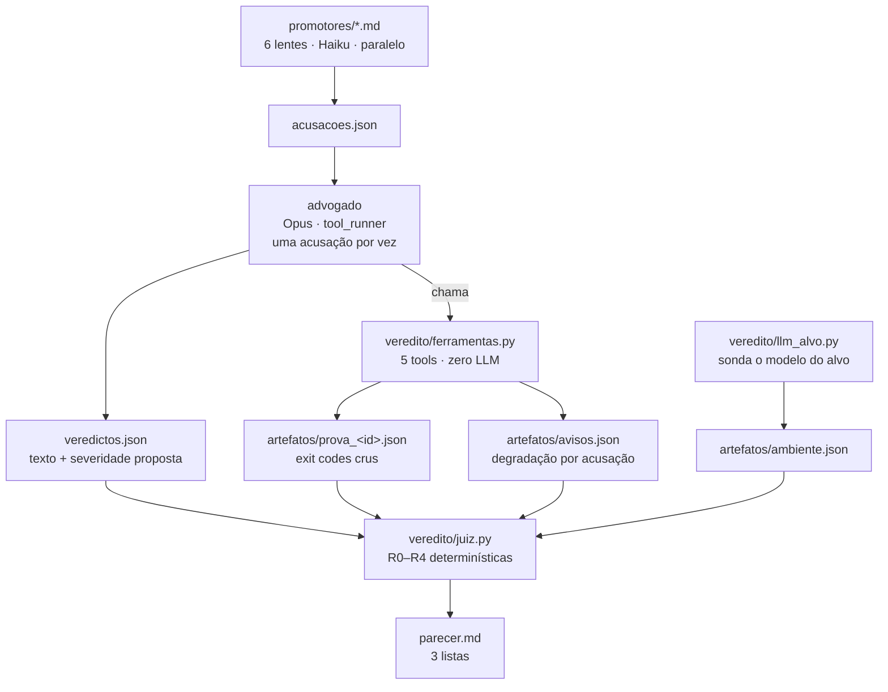

<!-- tag: hack2l -->

# Veredito

Revisor de código autônomo que trata cada suspeita como **acusação**: nada vira
parecer sem prova reproduzível.

O produto é este repositório. O `hack2l-challenge` ao lado é o **benchmark** —
uma aplicação RAG com um pull request contendo defeitos plantados e falsos
alarmes deliberados. O Veredito não sabe nada sobre ele: qual repositório,
qual branch e qual commit base saem todos do `.env`.

---

## A tese

Ferramenta de revisão por IA afirma. Esta **prova, ou diz que não conseguiu.**

> A severidade acompanha a **força da prova**, não a gravidade teórica.
> Nada é descartado em silêncio.

O motivo de isso importar tem número: o curl fechou o programa de bug bounty no
fim de janeiro de 2026 porque a taxa de confirmação despencou abaixo de 5% com a
enxurrada de relatórios gerados por IA. Imprecisão de IA já matou instituição.

Três estados, nunca dois:

| estado | significa | vai para |
|---|---|---|
| **PROVADO** | existe artefato reproduzível | condenados |
| **REFUTADO** | a perícia derrubou a acusação | descartados, **com motivo** |
| **INCONCLUSIVO** | a execução não permitiu decidir | inconclusivos, **com causa** |

O terceiro estado é a peça que quase todo mundo esquece. Sem ele, timeout, docker
fora do ar ou modelo recusando viram **absolvição limpa** — e o parecer esvazia
*parecendo rigor*.

---

## A invariante central

**O LLM propõe. O código dispõe.**

Existe uma fronteira de confiança exata no sistema, e ela não é negociável:

```
                    ┌──────────── o modelo pode errar aqui ────────────┐
                    │                                                   │
   promotores  ──►  acusações  ──►  advogado  ──►  texto do veredicto
                                        │
                                        │ chama ferramenta
                                        ▼
                    ┌──────────── aqui é só código ───────────────────┐
                    │  exit codes crus → artefatos/prova_<id>.json     │
                    └──────────────────────────────────────────────────┘
                                        │
                                        ▼
                              juiz lê o ARTEFATO
```

O advogado pode descrever a prova errado no texto dele. O artefato em disco
continua dizendo a verdade, porque `provado` foi calculado em Python a partir de
dois exit codes. E a **regra R0 do juiz** fecha a porta: se o advogado afirma
PROVADO e o artefato diz outra coisa, vale o artefato.

Isso aparece no código como uma convenção rígida em `ferramentas.py`:

```python
_funcao_privada(...) -> dict    # o que o juiz consome. Dado.
funcao_publica(...)  -> str     # o que o modelo lê. Prosa.
```

---

## Fluxo de dados



Todos esses arquivos moram na pasta **desta** rodada,
`saidas/rodadas/<data>T<hora>-<commit>/` — nada é escrito em caminho fixo, então
rodada não apaga rodada. `saidas/rodadas/ULTIMA` aponta para a mais recente, e é
assim que o juiz avulso se acha. Layout completo em `CONTRATO.md` §5.

### Por que disco entre cada etapa

Não é preferência de estilo, são três coisas de uma vez:

1. **Iteração.** Ajustar o juiz pela trigésima vez não pode re-executar o
   advogado. O juiz roda em 0,07 s lendo arquivo; a rodada do advogado leva
   dezenas de minutos.
2. **Auditabilidade.** O artefato é o que vai para o parecer e para o slide.
   Ele existe fora do processo que o gerou.
3. **Fronteira de equipe.** O mesmo corte que separa as etapas separa as duas
   pessoas: quem escreve promotor entrega `.md`, quem escreve o orquestrador lê
   a pasta. Integrar é dar commit — não existe reunião de integração.

---

## Mapa de módulos

| arquivo | responsabilidade | dono |
|---|---|---|
| `veredito/config.py` | **Único** lugar que lê o ambiente. Nada de porta, URL ou caminho fora daqui | Mariano |
| `veredito/ferramentas.py` | As 5 tools do advogado. **Zero chamada de LLM** — tudo verificável com pytest | Mariano |
| `veredito/juiz.py` | As regras determinísticas e o formato do parecer | Mariano |
| `veredito/llm_alvo.py` | O modelo do app alvo está vivo ou dublê? | Luis |
| `promotores/*.md` | 6 prompts, texto puro. O código lê a pasta, não importa nada | Luis |
| `veredito/advogado.py` | **ainda não existe** — o loop do `tool_runner` | Luis |
| `veredito/orquestrador.py` | **ainda não existe** — promotores → advogado → juiz | Luis |

Scripts de bancada na raiz, todos independentes: `checar_paridade.py` (a máquina
consegue rodar?), `testar_promotores.py` (os 6 prompts devolvem JSON válido, com
diff fictício), `verificar_chave_openai.py` (o LLM alvo acordou?).

### As 5 ferramentas

| tool | prova o quê | precisa de |
|---|---|---|
| `prova_diferencial` | regressão: passa no base, falha no head | docker + git |
| `run_tests` | a suíte existente ainda passa no head | docker |
| `read_file` | leitura numerada do head — `arquivo:linha` para a acusação | git |
| `grep` | busca por regex no head | git |
| `http_request` | a falha é alcançável de fora, autenticado como usuário do seed | app no ar |

---

## A prova diferencial

O mecanismo central. Roda o mesmo teste nos dois lados e compara.

```
base = git merge-base main origin/pr/document-sharing     ← calculado, nunca chumbado
head = origin/pr/document-sharing

worktree(base) ─┐
                ├─ mesmo arquivo de teste escrito nos dois
worktree(head) ─┘

pytest no base  → exit_base
pytest no head  → exit_head
pytest no base  → confirmação (só para candidato a PROVADO)
```

### Três decisões que parecem detalhe e não são

**1. `merge-base`, nunca hash escrito à mão.** A ponta da `main` pode ser *irmã*
do PR e não ancestral — foi o caso aqui: `f491ae1` só adiciona LICENSE/README, o
pai de verdade é `32a5241`. O código de `app/` é idêntico nos dois, então o teste
daria o mesmo resultado — mas o **artefato** registraria uma base que não é a do
PR, e é o artefato que vai para o slide. Também é isto que faz a troca de
benchmark funcionar sem editar código.

**2. Bind-mount, não rebuild.** O `Dockerfile` do alvo faz `COPY` do código e o
compose **não monta volume no serviço `api`**. Sem os `-v`, o pytest roda o
código assado na imagem e os dois lados dão o **mesmo resultado** — falso
negativo silencioso em toda prova. Provado com canário: um módulo que existe só
no worktree é importado com sucesso de dentro do container.

**3. Confirmação no base, depois do head.** O banco `kb` da aplicação nunca é
limpo entre execuções, e a ordem base-antes-de-head é fixa. Sem repetir o base
no fim, **ordem viraria prova**: um teste que suja o estado passaria antes e
falharia depois sem que o PR tivesse nada a ver.

### A tabela de classificação

Calculada em `_classifica`, sem LLM:

| pytest rodou? | `exit_base` | `exit_head` | estado |
|---|---|---|---|
| não (algum lado) | — | — | **INCONCLUSIVO**, `erro` com a saída do docker |
| sim | 0 | 1 | **PROVADO** (sujeito à confirmação) |
| sim | 0 | 0 | **REFUTADO** — a mudança não quebra isto |
| sim | qualquer outro par | | **INCONCLUSIVO**, com `motivo` |

---

## O teste é sobre a invariante, não sobre o endpoint

Parece haver um limite aqui: `prova_diferencial` só assina PROVADO se o teste
passa no base e falha no head, então um defeito em endpoint **novo** deveria
ser improvável — o endpoint não existe no base, o teste dá 404 lá, e o
resultado sai INCONCLUSIVO.

**Não é um limite; é uma questão de como o teste é escrito.**

| escrito sobre… | no base | resultado |
|---|---|---|
| o endpoint — *"GET /shared/1 como carol devolve 200"* | 404, falha | INCONCLUSIVO |
| a **invariante** — *"carol não alcança o documento de alice por rota nenhuma"* | passa (não havia como vazar) | **PROVADO** |

A invariante quase sempre já vale no commit base — é por isso que ela é
invariante. Formulada assim, a prova diferencial cobre regressão **e** endpoint
novo, e a evidência fica mais forte: não é *"esta função mudou"*, é *"esta regra
valia e a sua mudança quebrou"*.

Isso saiu de uma rodada real, não de projeto: a ferramenta foi documentada com
o limite acima, e o agente contornou sozinho ao escrever o teste sobre o
isolamento em vez de sobre a rota. A regra virou instrução no prompt do
advogado depois disso.

### Causalidade e alcance são provas diferentes

| prova | responde | artefato | severidade que sustenta |
|---|---|---|---|
| teste diferencial | *foi esta mudança que quebrou* | `artefatos/prova_<id>.json` | até MÉDIA (R2 rebaixa) |
| `http_request` | *dá para fazer isso de fora, agora* | `artefatos/http_<id>.json` | ALTA/CRÍTICA |

Por isso o advogado é instruído a fazer as duas quando o app está no ar: custa
uma volta do loop e muda a severidade final. Quando as duas fecham, o parecer
imprime a segunda como `E TAMBÉM:`.

A evidência por API **lista as chamadas em sequência, não só a última** — porque
o contraste é que é a prova. Medido na validação das 13h30:

```
EVIDENCIA: contra o app rodando --
  POST /documents/11/share?email=nonexistent' OR '1'='1  como alice -> HTTP 201
  POST /documents/11/share?email=nonexistent@nowhere.dev como alice -> HTTP 404
```

O payload passa, o controle não. Citar só a última imprimia o 404 sem graça e
escondia o 201 que era o achado.

**As duas gravam artefato — e isso não era verdade até 08/08.** `http_request`
era a única das cinco ferramentas sem rastro, justo a única que sustenta
severidade alta. Ver a landmine correspondente adiante.

⚠️ **O que `alcancou_a_api` garante, literalmente:** a acusação produziu ao menos
uma chamada que **completou** contra o app rodando — **inclusive um 404**. Não
significa "o defeito foi alcançado". Um 404 conta de propósito: prova de negação
indevida (403/404 onde deveria haver dado) é achado legítimo, e exigir 2xx
tornaria essa classe indemonstrável. O que o AND com a declaração do advogado
fecha é o buraco mudo — alegar prova por API sem nunca ter chamado nada.

---

## As regras do juiz

Determinísticas, em ordem, todas com teste, todas rodando sem rede.

| regra | o que faz | de onde vem o sinal |
|---|---|---|
| **R0** | o artefato ganha do advogado quando os dois discordam | `artefatos/prova_<id>.json` |
| **R0b** | quem decide `prova_ponta_a_ponta` é o artefato HTTP, **sempre** — inclusive quando não houve teste diferencial | `artefatos/http_<id>.json` |
| **R4** | REFUTADO em `injection` com LLM alvo dublê → INCONCLUSIVO | `ambiente.json` **ou** `avisos.json` |
| **R3** | execução falhou → INCONCLUSIVO, nunca absolvido | `erro` do artefato |
| **R1** | CRÍTICA sem árbitro citado → SUSPEITA | `arbitro` da acusação |
| **R2** | prova que não é ponta a ponta não passa de MÉDIA | `prova_ponta_a_ponta` |

Todo rebaixamento sai **impresso no parecer**, em `REGRAS:`. Rebaixar sem dizer
por que é tão opaco quanto não rebaixar.

**R4 tem escopo estreito de propósito: só `injection`.** Vazamento de contexto
fica de fora porque se prova por **citação**, e citação não depende do modelo
responder — um REFUTADO ali continua legítimo com o modelo dublê. Ampliar
incharia a lista de inconclusivos com descartes válidos, e inconclusivo inflado
enfraquece o parecer tanto quanto inconclusivo vazio.

---

## Landmines medidas nesta bancada

Cada uma custaria a demo. Todas viraram guarda com teste.

| o quê | sintoma se passar batido | guarda |
|---|---|---|
| **`docker compose` devolve exit 1** igual a "teste falhou" (`docker run` puro usa 125) | daemon caindo entre as execuções → **acusação crítica falsa**. E docker ruim no início mandava o advogado *"reescrever o teste para passar"* — enfraquecer teste correto | exige linha de resumo do pytest na saída; sem ela nada executou |
| **`localhost` resolve `::1` primeiro** no Windows, e o caminho IPv6 do Docker pendura | 0/8 sucesso em `localhost`, 8/8 em `127.0.0.1`. É ReadTimeout, então cada chamada gasta o timeout inteiro → INCONCLUSIVO em massa | `127.0.0.1` no `.env` + retry |
| **App alvo sem `OPENAI_API_KEY`** responde a mesma string para qualquer pergunta | payload de injection "não funcionou" → REFUTADO. **Absolvição falsa**, pior que falso alarme | sonda de duas perguntas + R4 |
| **Worktree obsoleto** quando `worktree add` falha | prova roda no commit **errado** e o artefato registra o commit pedido, não o montado | confere `rev-parse HEAD` depois do add |
| **Teste gerado escapa do bind-mount** — o container vê a rede do compose | teste que escreve em `kb` **apaga o seed** (o canário) no meio da rodada | recusa antes de executar |
| **A R0 ficava muda exatamente onde mais importava.** O aterramento de `prova_ponta_a_ponta` morava dentro de `if artefato is not None`, e `http_request` não gravava artefato nenhum | prova só por API pulava a conferência inteira: a **auto-declaração do advogado sustentava CRÍTICA sozinha** — o oposto do que a R0 existe para fazer. E na outra ponta o parecer imprimia `EVIDENCIA: nao fechou` para defeito que ele tinha visto acontecer. Morde neste PR em especial: os 3 endpoints são **novos**, então prova diferencial não fecha neles (404 no base é o inverso do padrão) e os achados específicos chegam só por API | `http_request` grava `artefatos/http_<id>.json` a cada chamada; a R0b saiu de dentro do `if` e virou AND — o modelo alega, o artefato corrobora |
| **Chave em prosa engole o veredito.** `re.search(r"\{.*\}", DOTALL)` é ganancioso: casa do **primeiro** `{` ao **último**, e o advogado escreve prosa antes do JSON — na rodada das 12h15 ela citava `email = '{email}'` e a rota `/documents/{id}/share` | 2 de 10 acusações: **PROVADO com artefato no disco virou INCONCLUSIVO**. O fallback que existe para a acusação não sumir por formato era quem sumia com ela — o LLM sobrescrevendo o exit code pela via mais boba | `raw_decode` a partir de cada `{`, do fim para o começo; ganha o último objeto válido com `veredito`. Saída crua preservada, então dá para reparsar sem re-rodar o advogado (~130 s/acusação) |
| **"Recusa do classificador" não aciona nada.** Verificado no `anthropic` 0.120.2: `tool_runner` **aceita** `fallbacks`, `"default"` é válido e `cyber` **é** categoria coberta — logo o pareamento está certo e a recusa significa outra coisa | 2 de 10 acusações, uma na categoria carro-chefe, com causa que não diz o que fazer. Fere a regra do desafio: INCONCLUSIVO **com a causa** | grava os dois sinais que distinguem — `recommended_model` preenchido = o fallback nem foi tentado (rate limit/sobrecarga, retry direto é acionável); `fallback_message` em `usage.iterations` = rodou e também recusou. Sem sinal, admite que não sabe |

A suíte do alvo antes de `32a5241` **apaga o banco da aplicação** — a mensagem
do commit é literalmente *"Stop the test suite from wiping the app database"*.
Base e head do PR são posteriores, mas experimento com histórico antigo destrói
o ambiente.

---

## Rodar

```bash
cp .env.example .env          # ANTHROPIC_API_KEY é o único bloqueio
python -m pip install -r requirements.txt
python checar_paridade.py     # a máquina consegue rodar? (8 checagens)

python -m veredito.juiz       # re-sentencia a ÚLTIMA rodada, sem re-executar o advogado
```

⚠️ **A checagem `app serve o PR` é a que evita o falso negativo mais caro entre
as duas máquinas.** O app no ar serve o código **assado na imagem**, não o
checkout do repo — então uma máquina com a imagem construída a partir da `main`
roda o Veredito inteiro sem erro nenhum e devolve **tudo em MÉDIA**:
`http_request` nunca alcança o código do PR, `prova_ponta_a_ponta` fica falsa, a
R2 rebaixa. O sintoma não parece problema de ambiente, parece o produto não
funcionando. Ela compara os routers do worktree do head com os de dentro do
container e diz o comando do conserto.

### 🚨 O `.env` é a única fonte — não duplique a chave no sistema

`load_dotenv` roda **sem** `override=True`, então **variável de ambiente já
definida vence o `.env`**. Isso é de propósito: é o que faz
`APP_EM_BANCO_DESCARTAVEL=1 python -m veredito.orquestrador` funcionar para uma
rodada só.

O preço é que uma chave duplicada no sistema **ganha em silêncio**. Medido em
14/08: a `ANTHROPIC_API_KEY` estava no `.env` **e** na variável de usuário do
Windows (via `setx`). Ela expirou, trocamos no `.env`, e o 401 continuou
**idêntico** — porque a do Windows é que valia. Custou quatro tentativas, e o
sintoma parecia problema de conta.

O pré-voo agora denuncia (só os nomes, nunca os valores):

```
[!] o .env NAO esta valendo para: ANTHROPIC_API_KEY
```

Se aparecer e não foi de propósito, apague a duplicata do sistema:

```powershell
[Environment]::SetEnvironmentVariable("ANTHROPIC_API_KEY", $null, "User")
```

Feche e reabra o terminal depois — processo já aberto continua com o valor
antigo. E confira antes que a chave boa está no `.env`, porque este comando
apaga a outra cópia.

O benchmark precisa estar no ar para `http_request`:

```bash
docker compose -f ../hack2l-challenge/docker-compose.yml \
  --project-directory ../hack2l-challenge up -d
```

### Testes

```bash
pytest tests -q -m "not lento"   # 85 rápidas, ~30 s, sem docker, sem rede
pytest tests -q                  # + 5 lentas, sobe container de verdade
```

`tests/test_advogado.py` cobre a fronteira entre o texto do modelo e o dado que
o juiz lê — é onde uma acusação provada pode sumir do parecer **parecendo
rigor**, e as duas últimas linhas da tabela de landmines nasceram ali.

As unitárias da regra central são as mais importantes do repo: é ali que mora a
decisão que o LLM não pode tomar. As lentas provam que o mecanismo funciona
ponta a ponta, com cenários sintéticos que **não dependem do conteúdo do PR** —
de propósito, porque a régua do desafio é que trocar o PR não pode quebrar o
agente, e uma suíte que só passa neste PR falharia a régua.

---

## Trocar o benchmark

A régua virou configuração. Nada de repositório, branch ou porta está no código:

```ini
CHALLENGE_REPO=../hack2l-challenge
PR_BRANCH=pr/document-sharing
BASE_BRANCH=main
APP_API_URL=http://127.0.0.1:8010
```

O `merge-base` é recalculado, os worktrees são recriados, os promotores
descrevem **classes de defeito** e não achados chumbados. Apontar para outro
repositório com outro PR não exige editar uma linha de Python.
